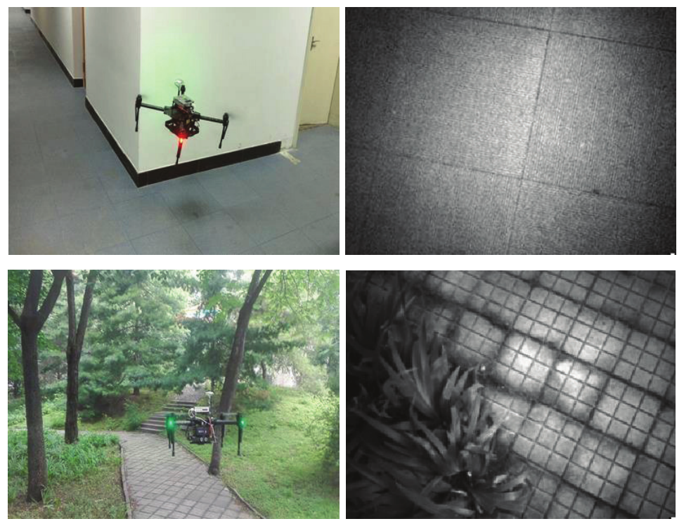

# Fourier-based Image Phase Correlation Method for Velocity Estimation of Multicopters
<!-- 
<center class="half">
    
</center> -->




This repository provides a code base to simulation and flight experiment codes from the paper "*Fourier-based Image Phase Correlation Method for Velocity Estimation of Multicopters*". 


## License and Citation
This project is licensed under the terms of the MIT license. By using the software, you are agreeing to the terms of the [license agreement](LICENSE).

If you use this code in your research, please cite us.

## Recommended system
Recommended system (tested):
- Ubuntu 16.04
- ROS Kinetic
- Python 2.7.12
- OpenCV 3.3.1

ROS packages used by the example provided and their recommended version:
- [airsim_ros_pkgs(Simulation)](https://github.com/microsoft/AirSim/tree/master/ros/src/airsim_ros_pkgs)
- [Gudiance-SDK-ROS(Flight experiment)](https://github.com/dji-sdk/Guidance-SDK-ROS)

## How to use
Clone the repo to the workspace source directory guidance_ws and then
```
cd ~/guidance_ws
catkin_make
source ~/guidance_ws/devel/setup.bash
```

### Simulation


In order for you to simulation the velocity estimation you first need to install AirSim.
- [Build AirSim on Linux](https://microsoft.github.io/AirSim/build_linux/)
- (Optional) [Download the binaries](https://github.com/microsoft/AirSim/releases) for the environment you like. We test in `Neighborhood`
- Run simulation environment and velocity estimation algorithms simultaneously.
    ```
    roscd airsim_environment/shell/
    ./all.sh
    ```
  If you use a custom environment, remember to modify `*.json` under `settings` folder and modify the environment path in `*.sh`.
- In the real flight experiment, the computer only needs to run the velocity estimation algorithms. Therefore, we recommend that the simulation environment and the velocity estimation algorithms be run separately.
    ```
    # environment_name is one of (building, neighborhood, soccer, mountain)
    # Use the keyboard to control the drone
    ./teleop.sh environment_name
    # Collect visual data
    ./record.sh environment_name
    # Run the velocity estimation algorithm
    ./play.sh environment_name
    # View in PlotJuggler
    ./plot environment_name
    ```

### Flight experiment
In the real flight experiment, you need to prepare the hardwares and compile the [Gudiance-SDK-ROS](https://github.com/dji-sdk/Guidance-SDK-ROS) in advance.

The Matrice 100 is equipped with a Guidance unit, which consists of stereo cameras and sonar sensors.

```
roslaunch rfly_launch main.launch
```

# Contributing

This project welcomes contributions and suggestions.  Most contributions require you to agree to a
Contributor License Agreement (CLA) declaring that you have the right to, and actually do, grant us
the rights to use your contribution.
